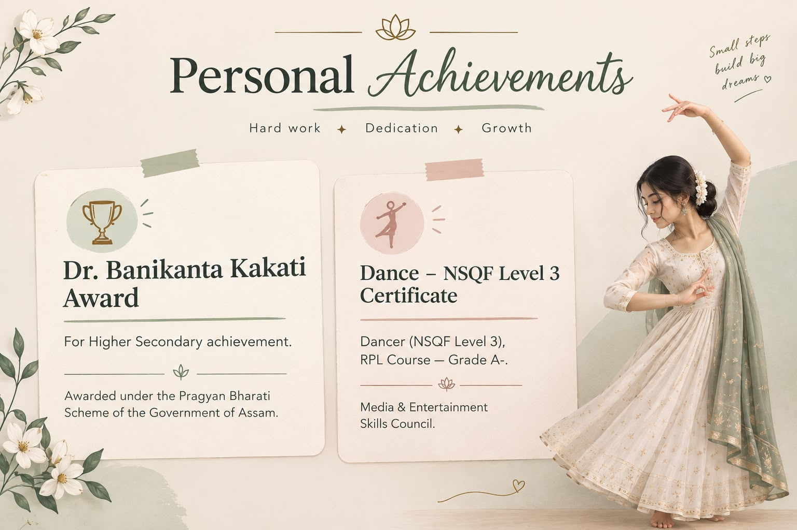

# 🏆 Personal Achievements

---

## 🎓 Academic Achievement

### Dr. Banikanta Kakati Award

For Higher Secondary achievement.

**Awarded under the Pragyan Bharati Scheme of the Government of Assam.**

📜 [View Award Certificate](./Dr-Banikanta-Kakati-Award-Assam-Gov.pdf)

---

## 💃 Extracurricular Achievement

### Dance – NSQF Level 3 Certificate

Successfully completed the **Dancer (NSQF Level 3) qualification** under the **RPL Course** with **Grade A-**, issued by the **Media & Entertainment Skills Council**.

📜 [View Dance Certificate](./Dance_NSQF_Level_3_Certificate.pdf)

---

## ✨ What These Achievements Represent

- 🎓 Academic dedication
- 💃 Creative expression
- 🌱 Personal growth
- 💪 Discipline and consistency
